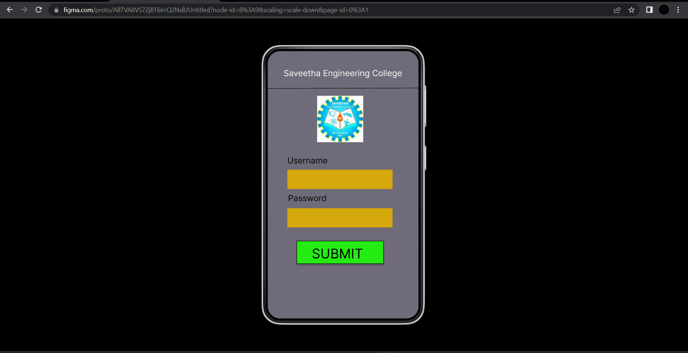
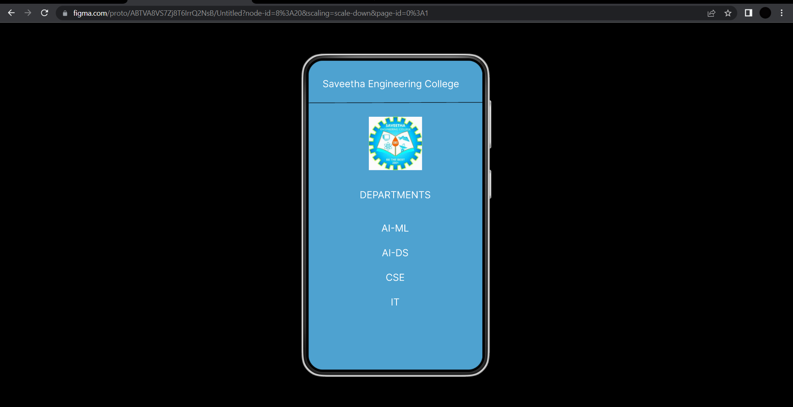
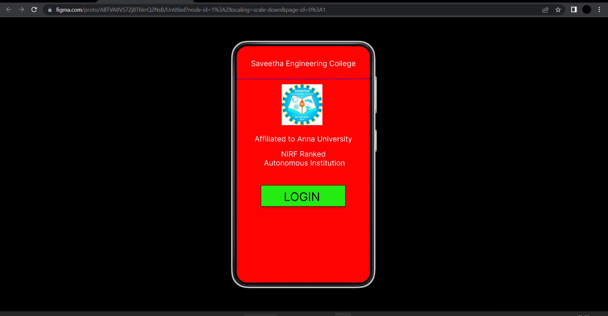

# Event Registration Web Application

## AIM:
To design, develop and deploy a web application for event registration.

## DESIGN STEPS:

### Step 1:
Create a new frame.

### Step 2:
Select any one preset size of your choice.

### Step 3:
Select the shapes you need.

### Step 4:
Import images as needed.

### Step 5:
Create pages based on your need and link them.

### Step 6:

Validate the HTML and CSS code.

### Step 6:

Publish the website in the given URL.

## DESIGN TOOL:
Figma

## code:
```
/* HomePage */

position: relative;
width: 360px;
height: 640px;
background: #FF0202;

/* Login page */

position: relative;
width: 360px;
height: 640px;
background: #706B7A;

/* SEC Page */

position: relative;
width: 360px;
height: 640px;
background: #4EA2D0;

/* Saveetha Engineering College */

position: absolute;
width: 323px;
height: 41px;
left: 9px;
top: 36px;
font-family: 'Inter';
font-style: normal;
font-weight: 400;
font-size: 20px;
line-height: 24px;
text-align: center;
color: #FFFFFF;

/* Line 3 */

position: absolute;
width: 360px;
height: 0px;
left: 0px;
top: 88px;
border: 1px solid #010104;
transform: rotate(-0.16deg);

/* saveetha logo 3 */

position: absolute;
width: 110px;
height: 111px;
left: 125px;
top: 116px;
background: url(saveetha logo.png);

/* DEPARTMENTS */

position: absolute;
width: 323px;
height: 41px;
left: 18px;
top: 266px;
font-family: 'Inter';
font-style: normal;
font-weight: 400;
font-size: 20px;
line-height: 24px;
text-align: center;
color: #FFFFFF;

/* AI-ML */

position: absolute;
width: 323px;
height: 41px;
left: 18px;
top: 335px;
font-family: 'Inter';
font-style: normal;
font-weight: 400;
font-size: 20px;
line-height: 24px;
text-align: center;
color: #FFFFFF;

/* AI-DS */

position: absolute;
width: 323px;
height: 41px;
left: 18px;
top: 386px;
font-family: 'Inter';
font-style: normal;
font-weight: 400;
font-size: 20px;
line-height: 24px;
text-align: center;
color: #FFFFFF;

/* CSE */

position: absolute;
width: 323px;
height: 41px;
left: 18px;
top: 437px;
font-family: 'Inter';
font-style: normal;
font-weight: 400;
font-size: 20px;
line-height: 24px;
text-align: center;
color: #FFFFFF;

/* IT */

position: absolute;
width: 323px;
height: 41px;
left: 18px;
top: 488px;
font-family: 'Inter';
font-style: normal;
font-weight: 400;
font-size: 20px;
line-height: 24px;
text-align: center;
color: #FFFFFF;

```
## OUTPUT:




## RESULT:
The program to design, develop and deploy a web application for event registration is completed successfully.